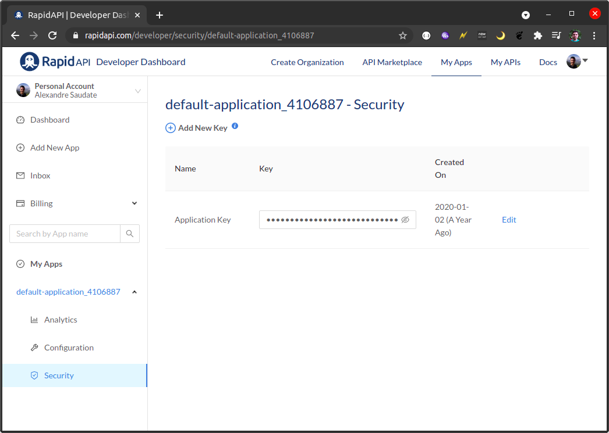

# Stock exchange (demo)

 

This project is about exposing API's that are capable of streaming the average price of some given stocks.

It is capable of both generating random, artificial values for the stocks and consuming an API to retrieve 
their actual value.

## How to run locally

If you want it to run with fake data, and you are on Linux, go to the root folder and type

``
./gradlew bootRun
``

After some seconds, it should start printing new average prices for [PAGS](https://finance.yahoo.com/quote/PAGS/). 

If you are on Windows, the command is

`
gradlew.bat bootRun
`

If you want it to run with live data, go to https://rapidapi.com/ and register yourself. Once done, create an 
application (or check if there's already one) on the platform and retrieve its Application Key:

Then, once you copy it, you can run the application like this:

`
./gradlew bootRun --args="--spring.profiles.active=live --interfaces.outcoming.rapidapi.key=<RAPID API APPLICATION KEY>"
`

### Adding more stocks

If you want to add some more stocks to be monitored, just open the file 
[application.yml](src/main/resources/application.yml) and add the stock under the key `domain.stocks`. As soon as you
restart the application, the updated stocks should be printed out. 

## Technology

This project is based on Spring WebFlux and reactive programming. As such, it uses its API's to fetch the data and 
start the streaming (which will ultimately reach the application client)

## What's contained in the package

- [Integration tests configured](gradle/integrationTest.gradle)
- [Coverage tests configured](gradle/coverage.gradle)
- [Contract tests](src/test/java/com/github/alesaudate/demostockexchange/tests/contract/StocksAveragePriceAPITestIT.java)
- [Swagger (Open API 3.0)](https://swagger.io/specification/)